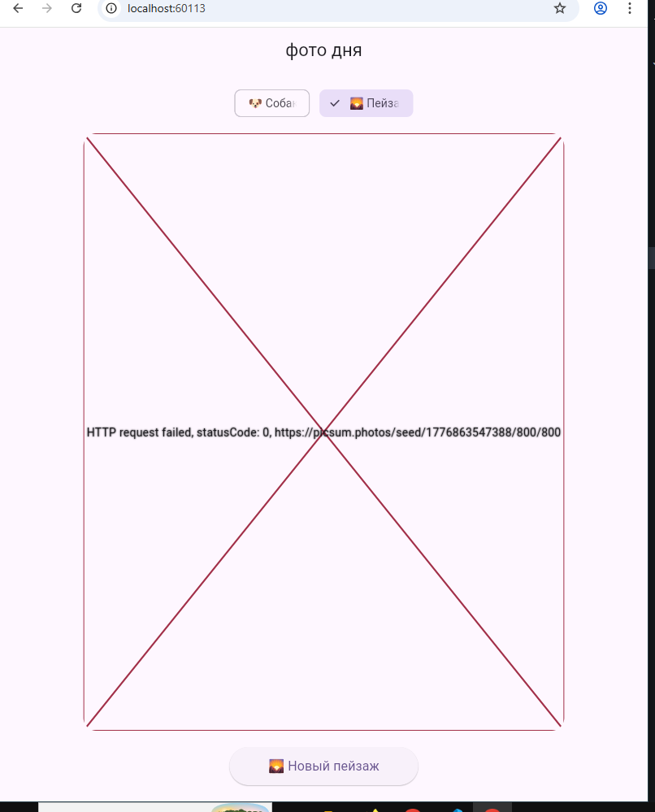

## Лабораторная работа №5. Асинхронность в Dart и Flutter.

### Описание

Мы создали приложение "Фото дня". По нажатию кнопки генерируется новое фото собаки или пейзажа.

### Авторы

**ФИО:** Ханов Владислав и Журавский Евгений

**Группа:** ИСП-231

### Стек и версии

- Flutter 3.41.1
- Dart 3.11.0
- Платформа: Web (Chrome)
- Пакет: http

### Скриншоты

### Как запустить?

1. `git clone <url>`
2. `cd photo_of_the_day`
3. `flutter pub get`
4. `flutter run -d chrome`

### Что изучили?

1. Мы поняли концепцию асинхронного программирования
2. Изучили Future, async/await в Dart
3. Научились применять эти знания во Flutter-приложении

### Ответы на вопросы

#### Что такое Future<T>? Чем отличается от обычного возвращаемого значения?

Future<T> — которые будут доступны не сейчас, а в будущем. Это основа асинхронного программирования, позволяющая выполнять долгие задачи (запросы в сеть, чтение файлов) в фоновом режиме, не блокируя основной поток выполнения.

#### Что делает await? Блокирует ли он весь поток выполнения?

Ключевое слово await используется в асинхронном программировании (async/await) для приостановки выполнения асинхронного метода до тех пор, пока ожидаемая задача не завершится. Оно не блокирует поток. В этом и заключается его главное отличие от синхронного ожидания.

#### Зачем setState() вызывается дважды в _fetchPhoto()?

Первый setState() нужен, чтобы сразу показать индикатор загрузки и очистить старые данные (картинку и ошибку).
    Второй setState() нужен, чтобы выключить индикатор загрузки после того, как данные загрузились (или произошла ошибка), и показать результат на экране.
    Без первого вызова экран не отреагирует мгновенно — индикатор загрузки появится слишком поздно.
    Без второго вызова индикатор загрузки будет крутиться вечно, даже когда данные уже готовы.

#### Почему кнопке передаётся _fetchPhoto без скобок, а не _fetchPhoto()?

Потому что в onPressed нужно передать ссылку на функцию, а не результат её вызова.
    _fetchPhoto — это ссылка на функцию. Кнопка сама вызовет её в нужный момент (когда пользователь нажмёт).
    _fetchPhoto() — это вызов функции сразу во время сборки интерфейса. Тогда функция запустится до того, как пользователь вообще увидит кнопку.
Если написать со скобками, функция выполнится мгновенно, а не по нажатию.

#### Чем Image.network() отличается от Image.asset()?

    Image.network() — загружает картинку из интернета по URL-адресу. Требует подключения к сети и может работать медленно.
    Image.asset() — загружает картинку из папки assets внутри самого приложения. Работает мгновенно и без интернета, но увеличивает размер приложения.